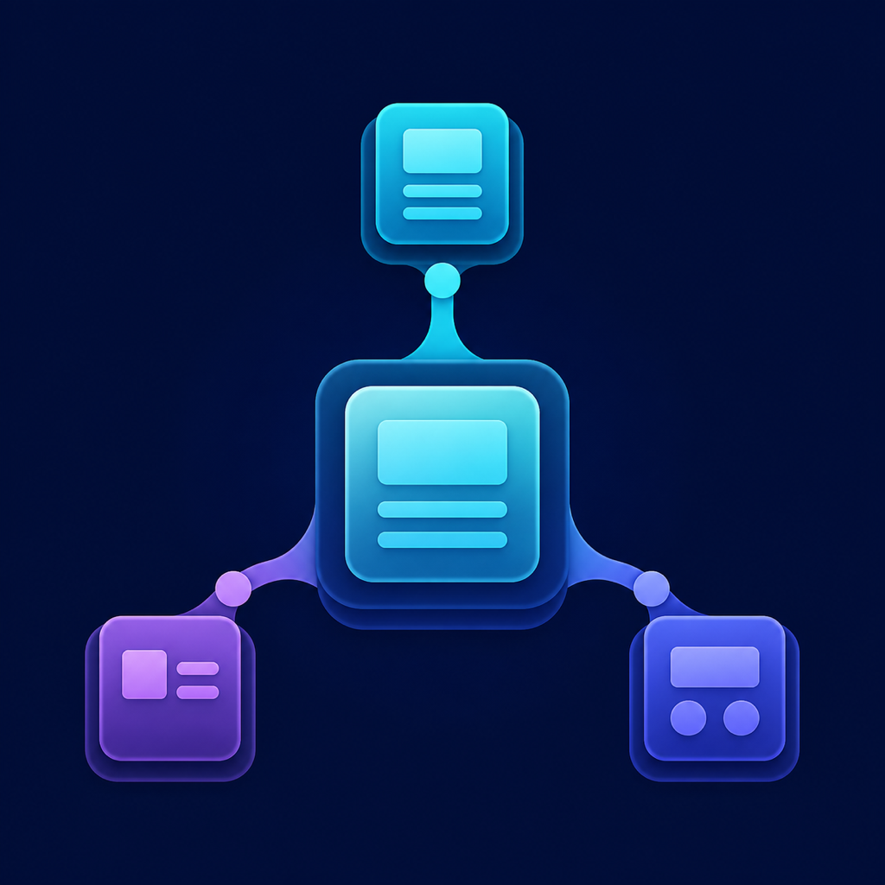
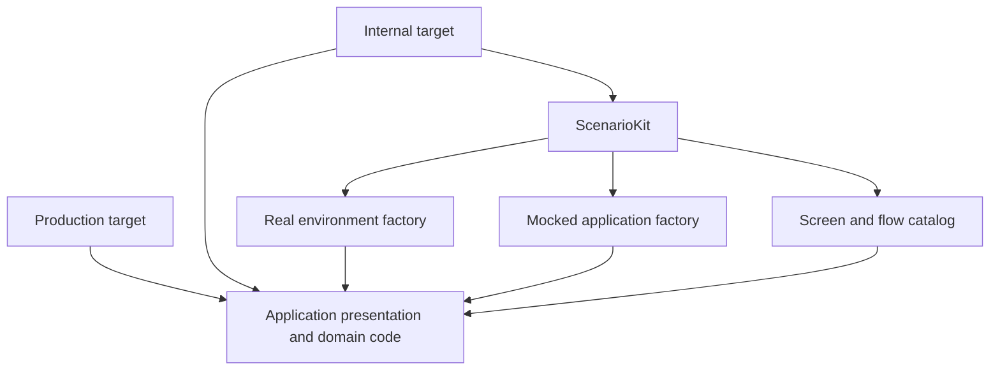
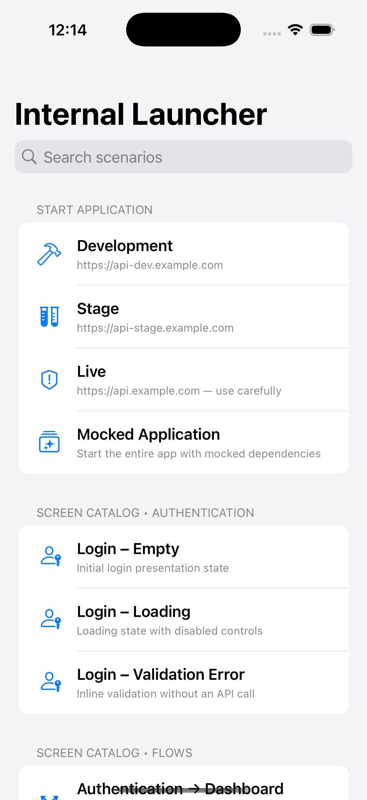

<p align="center">
  
</p>

# ScenarioKit

ScenarioKit is a small SwiftUI package for internal iOS builds. It lets a team launch the real application against different environments, run the complete application with mocked dependencies, or open a deterministic screen and feature flow without waiting for a backend.

The package is intentionally limited to composition and presentation. It does not know about networking, authentication, application models, API URLs, or a specific dependency-injection framework.

- iOS 15+
- Swift 6 with strict concurrency checking
- Swift Package Manager
- No third-party dependencies

## Why it exists

An application often needs more than Xcode previews while it is under active development:

- Backend environments may be incomplete or temporarily unavailable.
- QA and designers need deterministic states that do not depend on live data.
- A feature flow may need to be demonstrated before its API exists.
- Error, loading, empty, and edge-case states should be reachable without changing production code.
- Internal tooling must never leak into the production target.

ScenarioKit provides one internal launcher for those workflows while keeping all app-specific mocks and composition in the host application.

| Mode | Purpose |
| --- | --- |
| Environment | Starts the real application composition against Development, Stage, Live, or another app-defined environment. |
| Mocked Application | Starts the complete production presentation layer with app-owned mocked dependencies. |
| Scenario | Opens one deterministic screen or an interactive multi-screen flow. |

## Architecture



Only the internal target links `ScenarioKit`. The production target builds the same shared application code without the package, mock repositories, launcher, or scenarios.

`ScenarioKitRootView` replaces the complete root when the selected mode changes. It does not push the application through the launcher's navigation stack or inject a navigation bar into production UI.

## Example

The included example has separate `ScenarioDemo` and `ScenarioDemoInternal` targets. The internal target demonstrates three backend environments, a fully mocked application, isolated presentation states, an interactive authentication-to-dashboard flow, search, persistence, production-environment confirmation, and a Home Screen quick action for returning to the launcher.

<p align="center">
  
</p>

Open [ScenarioDemo.xcodeproj](Example/ScenarioDemo/ScenarioDemo.xcodeproj) and run the `ScenarioDemoInternal` scheme.

## Installation

Add this repository as a Swift Package dependency and link the `ScenarioKit` product only to an internal or development app target.

```swift
dependencies: [
    .package(
        url: "https://github.com/NikolaPopovic993/ScenarioKit.git",
        from: "1.0.0"
    )
]
```

The package manifest lives at the repository root, so the repository can also be added as a local package while developing it.

## Usage

### 1. Describe application environments

The package persists only a string identifier. The host application remains responsible for converting that identifier into its own environment and composition root.

```swift
let configuration = ScenarioLauncherConfiguration(
    environments: [
        ScenarioEnvironment(
            id: "development",
            title: "Development",
            subtitle: "https://api-dev.example.com",
            systemImage: "hammer"
        ),
        ScenarioEnvironment(
            id: "stage",
            title: "Stage",
            subtitle: "https://api-stage.example.com",
            systemImage: "testtube.2"
        ),
        ScenarioEnvironment(
            id: "live",
            title: "Live",
            subtitle: "Production backend",
            systemImage: "exclamationmark.shield",
            requiresConfirmation: true,
            confirmationTitle: "Start Live environment?",
            confirmationMessage: "This environment may use production data."
        )
    ],
    mockedApplication: ScenarioMockedApplicationOption(
        subtitle: "Run the entire app without a backend"
    )
)
```

Environment identifiers must be unique. Invalid restored identifiers are handled by the root view instead of being passed to the application factory.

### 2. Define screens and flows with the same API

A scenario owns its metadata, deterministic dependencies, and the production view or flow it creates.

```swift
struct CheckoutPaymentErrorScenario: Scenario {
    let metadata = ScenarioMetadata(
        id: "checkout.payment.error",
        title: "Checkout – Payment Error",
        subtitle: "Declined payment with retry available",
        category: "Checkout",
        systemImage: "creditcard.trianglebadge.exclamationmark"
    )

    func makeBody() -> some View {
        CheckoutView(
            viewModel: CheckoutViewModel(
                repository: CheckoutRepositoryStub(result: .paymentDeclined)
            )
        )
    }
}

struct OnboardingFlowScenario: Scenario {
    let metadata = ScenarioMetadata(
        id: "onboarding.happy-path",
        title: "Onboarding – Happy Path",
        category: "Flows"
    )

    func makeBody() -> some View {
        OnboardingFlow(container: .mocked)
    }
}
```

`Scenario` is the only public scenario-definition API. Type erasure is kept inside the package at the catalog boundary.

### 3. Build a catalog

```swift
let catalog = ScenarioCatalog {
    LoginEmptyScenario()
    LoginValidationErrorScenario()
    HomeLoadedScenario()
    CheckoutPaymentErrorScenario()
    OnboardingFlowScenario()
}
```

The result builder supports conditionals and collections. Scenario identifiers must be unique; duplicate identifiers fail immediately as a developer configuration error.

### 4. Create a session

```swift
@MainActor
let session = ScenarioSession(
    restoreLastEnvironmentOnLaunch: true,
    selectionStore: UserDefaultsScenarioEnvironmentSelectionStore(
        namespace: "com.company.app.internal"
    )
)
```

The selection store is injected and can be replaced by an app-specific implementation. Networking and other production dependencies never read `UserDefaults` directly.

### 5. Compose the internal root

```swift
ScenarioKitRootView(
    session: session,
    configuration: configuration,
    catalog: catalog
) { environmentID in
    ApplicationRootView(
        container: AppContainerFactory.make(environmentID: environmentID)
    )
} makeMockedApplication: {
    ApplicationRootView(
        container: AppContainerFactory.makeMockedApplication()
    )
}
```

The host app decides how developers return to the launcher. The example provides both a visible floating control and a Home Screen quick action.

## Repository layout

```text
ScenarioKit
├── Package.swift
├── Sources/ScenarioKit
├── Tests/ScenarioKitTests
├── Example/ScenarioDemo
│   ├── App
│   │   ├── Composition
│   │   ├── Domain
│   │   ├── Features
│   │   └── Production
│   ├── Internal
│   │   ├── Application
│   │   ├── Composition
│   │   ├── Mocks
│   │   └── Scenarios
│   └── ScenarioDemo.xcodeproj
└── .github/workflows/ci.yml
```

Keep concrete scenarios in the internal application target first. Move them into an app-specific feature package only when that application's production features are already modularized.

## Testing

The package tests run as iOS tests through the internal example scheme:

```bash
xcodebuild \
  -project Example/ScenarioDemo/ScenarioDemo.xcodeproj \
  -scheme ScenarioDemoInternal \
  -destination 'platform=iOS Simulator,name=iPhone 16 Pro' \
  CODE_SIGNING_ALLOWED=NO \
  test
```

CI builds both application targets and runs the same iOS test suite. Tests cover catalog construction, result-builder control flow, view lookup, environment persistence, restoration, and session mode transitions.

## Design decisions

- App-owned composition: the package receives environment identifiers and view factories instead of owning API clients or application containers.
- Production isolation: the package is linked only by the internal target.
- One scenario abstraction: screens and complete flows use the same `Scenario` protocol.
- Controlled type erasure: `AnyView` exists only inside the package at dynamic composition boundaries.
- Deterministic dependencies: mocked repositories remain next to the internal application that understands their domain.
- Main-actor UI state: session, catalog construction, and view creation are explicitly main-actor isolated.

## Non-goals

ScenarioKit is not a networking mock framework, dependency-injection container, snapshot-testing library, or replacement for SwiftUI previews. It is a focused internal composition tool that makes real application UI and flows easy to reach.

## License

ScenarioKit is available under the MIT License. See [LICENSE](LICENSE).
